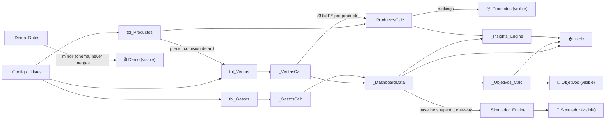

# Profitly — Arquitectura Técnica (Fase 1)

> Nota de idioma: este documento es material interno de arquitectura (audiencia: equipo de desarrollo), por lo que está en inglés para claridad técnica, tal como indica el brief. Todos los nombres de hoja, columnas, KPIs, botones y mensajes citados aquí **son el texto real y final en español** que verá el usuario — no se traducen en fases posteriores.
>
> Scope of this document: **Phase 1 — Technical Architecture** only, per the brief's development process (§26). No workbook is built yet. This defines worksheets, tables, relationships, input/calculation areas, dashboard data sources, formula-dependency flow, validation rules, and the protection strategy that Phases 2–10 will implement against.

---

## 1. Design Constraints Driving the Architecture

These constraints (from the brief) shape every decision below; each is restated here because it rules out otherwise-obvious approaches:

| Constraint | Architectural consequence |
|---|---|
| No VBA/macros unless absolutely necessary | Navigation, mode-switching (Demo vs. Mi Negocio), and "buttons" must be built from hyperlinks, data validation, and formulas — not macros. |
| Excel **and** Google Sheets compatibility | Avoid Excel-only functions (no `XLOOKUP`-only design, no dynamic arrays as a hard dependency). Prefer `INDEX/MATCH`, `SUMIFS/COUNTIFS/AVERAGEIFS`, `IFERROR`. Minimize volatile functions (`OFFSET`, `INDIRECT`, `NOW`, `TODAY` used sparingly and isolated). |
| User must never edit a formula | Every calculated cell lives in a locked, visually distinct cell; all formula logic is pushed into hidden "engine" sheets where feasible. |
| A fact is entered once | Products are entered once in **Productos** and referenced everywhere else (Ventas, Dashboard, Insights, Simulador) via lookups — never re-typed. |
| No Excel errors ever visible (`#DIV/0!`, `#N/A`, etc.) | Every formula that can fail is wrapped in a guard (`IFERROR`/`IF`) that resolves to a centralized Spanish message. |
| Demo data must never mix with real data | Demo lives in fully separate tables and a parallel (hidden-until-selected) sheet group, not a toggle over shared cells. |
| Workbook must stay responsive | Aggregation is pre-computed once per "engine" sheet using structured-table `SUMIFS`, not scattered full-column array formulas repeated on every visible sheet. |

---

## 2. Two-Layer Sheet Model

Profitly is built as **two layers**:

1. **App Layer (visible)** — what the user sees and touches. Styled like a SaaS product. Spanish only. Sheet tab names use an emoji + Spanish label to double as the navigation system (per §3 of the brief).
2. **Engine Layer (hidden)** — where data lives, gets validated, aggregated, and ranked. No direct user interaction. Locked/protected. Prefixed with `_` so it sorts to the end of the tab list and is visually identifiable as internal.

This separation is what lets the App Layer stay "simple on the surface" while the Engine Layer stays "powerful under the hood": dashboard sheets never contain a raw `SUMIFS` over thousands of transaction rows — they reference one pre-aggregated cell in an engine sheet.

### 2.1 Full Sheet Inventory

| # | Tab name (as shown to user) | Layer | Purpose | Input? | Protected? |
|---|---|---|---|---|---|
| 1 | `🏠 Inicio` | App | Dashboard / control center | No (read-only + demo/mode switch) | Yes, formulas locked |
| 2 | `⚙️ Configuración` | App | Onboarding + business settings | Yes (setup fields only) | Yes, partial |
| 3 | `📦 Productos` | App | Product catalog + profitability + rankings | Yes (product fields only) | Yes, partial |
| 4 | `🛒 Ventas` | App | Sales log (transaction entry) | Yes (sale fields only) | Yes, partial |
| 5 | `💸 Gastos` | App | Operating expense log | Yes (expense fields only) | Yes, partial |
| 6 | `🎯 Objetivos` | App | Goal definition + progress + "what it takes" | Yes (goal amount only) | Yes, partial |
| 7 | `🔬 Simulador` | App | What-if simulator (isolated, non-destructive) | Yes (scenario sliders only) | Yes, partial |
| 8 | `🧭 Menú` | App | Visual home/navigation hub (optional landing before Inicio; see §3.1) | No | Yes, fully locked |
| 9 | `🎬 Demo` | App | Read-only walkthrough of Profitly pre-loaded with fictional data, mirrors Inicio | No | Yes, fully locked |
| 10 | `_Config` | Engine | Named settings, current period, mode flag, validation source list references | Onboarding writes here indirectly | Yes, fully locked except onboarding-mapped cells |
| 11 | `_Listas` | Engine | Canonical dropdown lists (categorías, canales, tipos de gasto, monedas) | No (edited only via Configuración) | Yes |
| 12 | `_ProductosCalc` | Engine | Full unit-economics calculation per product (mirrors tbl_Productos 1:1) | No | Yes |
| 13 | `_VentasCalc` | Engine | Per-sale real-cost and profit breakdown (mirrors tbl_Ventas 1:1) | No | Yes |
| 14 | `_GastosCalc` | Engine | Period-bucketed expense aggregation | No | Yes |
| 15 | `_DashboardData` | Engine | Pre-aggregated KPIs, period series, rankings feeding the 3 dashboard charts | No | Yes |
| 16 | `_Objetivos_Calc` | Engine | Goal math (remaining, needed daily/total sales, feasibility check) | No | Yes |
| 17 | `_Insights_Rules` | Engine | Rule table (condition → Spanish message template → priority) | No (content authored once by Profitly team, not the user) | Yes |
| 18 | `_Insights_Engine` | Engine | Evaluates `_Insights_Rules` against `_DashboardData`, outputs the (max 4) insight strings shown on Inicio | No | Yes |
| 19 | `_Simulador_Engine` | Engine | Baseline snapshot (read-only copy of current real KPIs) + delta math → projected scenario | No | Yes |
| 20 | `_Demo_Datos` | Engine | Fictional demo dataset in the exact schema of Productos/Ventas/Gastos | No | Yes |
| 21 | `_Textos` | Engine | Centralized Spanish UI strings, tooltips (ⓘ), and error messages | No | Yes |

Design rationale: 21 sheets sounds like a lot, but only **7 are ever opened by the user** (plus the optional Menu/Demo). The rest is exactly the "invisible spreadsheet architecture" the brief requires (§3: *"the underlying spreadsheet architecture should remain invisible whenever possible"*).

### 2.2 Why Demo is a parallel sheet, not a toggle

The brief is explicit: demo data must never mix with real data (§15), and macros should be avoided (§19). A single-dashboard "mode switch" driven by `INDIRECT`/`CHOOSE` would satisfy the no-macro constraint but reintroduces volatility and risks a user accidentally viewing demo numbers as if they were their own. Instead:

- `_Demo_Datos` holds a complete fictional dataset in the same table schema as the real tables.
- `🎬 Demo` is a fully self-contained, locked, read-only sheet that reproduces the Inicio layout but sources exclusively from `_Demo_Datos` (through its own small `_DashboardData`-style block, not shared with the real one).
- The nav hub (`🧭 Menú`) links to `🎬 Demo` and `🏠 Inicio` as two clearly separate destinations, labeled **"DEMO"** and **"MI NEGOCIO"** per §15's explicit instruction.
- Nothing the user types ever lands in `_Demo_Datos`, and nothing in Demo can be edited (fully protected sheet).

---

## 3. Data Model

### 3.1 Config (single source of business settings)

`_Config` holds one **key → value** block, exposed as named ranges so every formula in the workbook references a name, not a cell address (this is what makes the workbook resilient to row insertions and what lets Configuración stay the single onboarding point):

| Named range | Set from | Used by |
|---|---|---|
| `Cfg_NombreNegocio` | Configuración | Inicio header, Demo/PDF export |
| `Cfg_Moneda` | Configuración | All currency-formatted cells (number format applied via a currency symbol string, not a locale — keeps Sheets/Excel identical) |
| `Cfg_TipoNegocio` | Configuración | Onboarding only (cosmetic, may steer default categories) |
| `Cfg_ObjetivoMensualDefault` | Configuración | `_Objetivos_Calc` fallback when a specific month has no explicit goal row |
| `Cfg_PeriodoInicio` / `Cfg_PeriodoFin` | Auto (current month) or user-adjustable date filter on Inicio | `_DashboardData`, `_Insights_Engine` |
| `Cfg_ModoActivo` | Set by which sheet the user is on (Demo vs. Mi Negocio) — used only for display text, never for branching real calculations | Inicio header ("Viendo: Mi Negocio") |

`_Listas` holds the canonical option lists behind every dropdown: `Lst_Categorias`, `Lst_Canales`, `Lst_TiposGasto`, `Lst_Monedas`. Configuración lets the user edit categories/canales during onboarding; those edits write directly into these list ranges (so Productos/Ventas dropdowns update immediately — this is the "enter once" rule applied to configuration, too).

### 3.2 Core Tables

All four are native **Excel Tables** (`ListObject`) / Google Sheets equivalent named ranges bound to a header row, so they auto-expand on new rows and every formula can use structured references (`tbl_Productos[Margen]`) instead of brittle `$A$2:$A$500` ranges.

**`tbl_Productos`** (sheet `📦 Productos`)

| Column | Type | Source |
|---|---|---|
| Producto | text | input |
| Categoría | dropdown (`Lst_Categorias`) | input |
| Precio de venta | currency | input |
| Costo del producto | currency | input |
| Comisión % | percent | input |
| Packaging | currency | input |
| Envío / costo asociado | currency | input |
| Publicidad atribuida | currency | input |
| Otros costos | currency | input |
| *Costo real de venta* | currency | **calc** — `_ProductosCalc` |
| *Ganancia por unidad* | currency | **calc** |
| *Margen* | percent | **calc** |
| *Unidades vendidas* | number | **calc** — aggregated from `tbl_Ventas` |
| *Ganancia total* | currency | **calc** — aggregated from `tbl_Ventas` |

Italicized rows are shown on the Productos sheet but are formula-driven and locked; the actual formulas live in `_ProductosCalc`, mirrored 1:1 by row, and pulled into Productos with a simple same-row reference. This indirection exists so a future recalculation-heavy change (e.g., adding a new cost component) touches one engine sheet, not the styled front-end sheet.

**`tbl_Ventas`** (sheet `🛒 Ventas`)

| Column | Type | Source |
|---|---|---|
| Fecha | date | input |
| Producto | dropdown (`tbl_Productos[Producto]`) | input |
| Cantidad | number ≥ 1 | input |
| Precio de venta | currency | **auto-filled** from `tbl_Productos` lookup on row entry, editable (covers promo/negotiated pricing) |
| Canal | dropdown (`Lst_Canales`) | input |
| Comisión % | percent | **auto-filled** from product default, editable |
| Descuento | currency | input, default 0 |
| Otros costos | currency | input, default 0 |
| *Venta total* | currency | **calc** — `_VentasCalc` |
| *Ganancia* | currency | **calc** — `_VentasCalc` |

Only **Fecha, Producto, Cantidad, Canal, Descuento** truly require typing for a typical sale; Precio and Comisión pre-fill from the product record, satisfying §8: *"Avoid requiring users to manually enter information that can be automatically derived."*

**`tbl_Gastos`** (sheet `💸 Gastos`) — operating expenses only (see §3.3 for why "costos de venta" do **not** live here)

| Column | Type | Source |
|---|---|---|
| Fecha | date | input |
| Categoría | dropdown (`Lst_TiposGasto`: Publicidad, Software/Suscripciones, Packaging general, Herramientas, Otros…) | input |
| Descripción | text | input |
| Importe | currency | input |
| Tipo de gasto | dropdown: Fijo / Variable / Único | input (used only for display grouping, not for the profit formula) |

**`tbl_Objetivos`** (sheet `🎯 Objetivos`)

| Column | Type | Source |
|---|---|---|
| Periodo (Mes-Año) | date (month) | input |
| Objetivo de ganancia | currency | input, defaults to `Cfg_ObjetivoMensualDefault` |

A row per month lets the user override the default goal for a specific period without losing history; `_Objetivos_Calc` looks up the row matching the current period, falling back to the default.

### 3.3 The "true cost" rule (§12) drives the table split

The brief is explicit that `Precio − Costo del producto ≠ Ganancia real`. The architecture encodes this as two distinct expense categories that must never be merged:

```
COSTO REAL DE VENTA (per unit, computed in _ProductosCalc / _VentasCalc)
  = Costo del producto
  + (Precio de venta × Comisión %)
  + Envío
  + Packaging
  + Publicidad atribuida
  + Otros costos

GANANCIA POR VENTA = Precio de venta − Costo real de venta   →  "ganancia del producto"

GASTOS DEL NEGOCIO (tbl_Gastos, period total, not tied to any single unit)

GANANCIA REAL DEL NEGOCIO = Σ Ganancia por venta − Gastos del negocio del período
```

This is why `tbl_Gastos` intentionally has **no per-product field**: anything attributable to a specific unit belongs in `tbl_Productos`/`tbl_Ventas` cost columns (so it flows into "ganancia del producto"); anything that is a cost of running the business regardless of volume belongs in `tbl_Gastos` (so it only affects "ganancia real del negocio"). This mapping must be called out explicitly in Configuración's onboarding copy, since it's the single most common source of user confusion in this product category.

---

## 4. Calculation & Aggregation Layer

### 4.1 `_ProductosCalc` (per product row, mirrors `tbl_Productos`)

```
Costo real de venta   = Costo del producto + (Precio venta × Comisión%) + Packaging + Envío + Publicidad atribuida + Otros costos
Ganancia por unidad   = Precio de venta − Costo real de venta
Margen                = IFERROR(Ganancia por unidad / Precio de venta, "—")   → guarded, see §6
Unidades vendidas     = SUMIFS(tbl_Ventas[Cantidad], tbl_Ventas[Producto], [@Producto])
Ganancia total        = SUMIFS(tbl_Ventas[Ganancia], tbl_Ventas[Producto], [@Producto])
```

Rankings (shown on Productos as small leaderboards, §7) are derived from this same sheet, not recomputed elsewhere:

- 🏆 **Producto más rentable** = row with `MAX(Margen)` among products with `Unidades vendidas > 0`
- 🔥 **Producto más vendido** = row with `MAX(Unidades vendidas)`
- 💰 **Producto que más dinero genera** = row with `MAX(Ganancia total)`
- ⚠️ **Producto con margen bajo** = rows where `Margen < Cfg_MargenAlertaUmbral` (a configurable threshold, default 15%)

These four are computed with `INDEX/MATCH` against the `MAX`/filtered set — deliberately kept as **relative, not hardcoded** comparisons, so the ranking logic never needs to change as products are added.

### 4.2 `_VentasCalc` (per sale row, mirrors `tbl_Ventas`)

```
Costo real de venta (unitario) = XLOOKUP-safe INDEX/MATCH into tbl_Productos by [@Producto] → reuses _ProductosCalc's per-unit cost
Venta total  = (Cantidad × Precio de venta) − Descuento
Ganancia     = Venta total − (Costo real de venta unitario × Cantidad) − Otros costos
```

Note the sale's own `Otros costos` (e.g., a one-off return/refund fee) is additive to the product's baseline `Otros costos`, not a duplicate of it — this is called out in the ⓘ tooltip on that column so users don't double-enter recurring per-unit costs that already live on the product.

### 4.3 `_GastosCalc` (period buckets)

```
Gastos del negocio (período actual) = SUMIFS(tbl_Gastos[Importe], tbl_Gastos[Fecha], ">="&Cfg_PeriodoInicio, tbl_Gastos[Fecha], "<="&Cfg_PeriodoFin)
```
Also buckets by Categoría for the (optional, Pro-mode-deferred, see §7) expense breakdown, and by month for trend use in `_DashboardData`.

### 4.4 `_DashboardData` (single aggregation point for Inicio)

Every KPI card and chart on `🏠 Inicio` reads exactly one cell/range from here — never a live `SUMIFS` recomputed on the dashboard sheet itself (keeps Inicio fast and keeps chart data ranges stable).

| KPI | Formula source |
|---|---|
| Ventas del período | `SUM(tbl_Ventas[Venta total])` filtered to period |
| Costos de venta del período | `SUM` of the per-sale cost component (`Cantidad × Costo real de venta unitario`) filtered to period |
| Ganancia de productos | Ventas del período − Costos de venta del período |
| Gastos del período | from `_GastosCalc` |
| **Ganancia real** | Ganancia de productos − Gastos del período |
| Margen real | Ganancia real / Ventas del período (guarded) |
| Ticket promedio | Ventas del período / COUNT of sale rows in period (guarded) |
| Objetivo mensual / Progreso % | from `_Objetivos_Calc` |
| Comparación con período anterior | same KPI block computed a second time with `Cfg_PeriodoInicio`/`Fin` shifted back one period, stored side-by-side for the ▲/▼ deltas shown on the KPI cards |

Chart data ranges:

1. **Evolución de ventas y ganancia** — a small monthly (or weekly, if `<3` months of data) table of the last 6 periods: `Periodo | Ventas | Ganancia`, each cell a `SUMIFS` bucketed by date — this table is the literal chart source range.
2. **Ganancia por producto** — `tbl_Productos[Producto]` + `[Ganancia total]`, sorted descending, top 8 (rest bucketed as "Otros" to keep the chart legible per §4's "do not overload the dashboard").
3. **Progreso hacia el objetivo** — single-series progress value from `_Objetivos_Calc`, rendered as a progress-bar-style chart (stacked bar: alcanzado vs. restante, capped visually at 100%).

### 4.5 `_Objetivos_Calc`

```
Ganancia objetivo   = lookup tbl_Objetivos row for current period, else Cfg_ObjetivoMensualDefault
Ganancia actual     = Ganancia real (this period), from _DashboardData
Restante            = MAX(Ganancia objetivo − Ganancia actual, 0)
Progreso %          = MIN(Ganancia actual / Ganancia objetivo, 100%), guarded
Días restantes      = días restantes en el mes calendario actual
Ganancia diaria necesaria = Restante / Días restantes (guarded: if 0 días restantes → message, not #DIV/0!)
Margen actual        = Margen real, from _DashboardData
Facturación necesaria = Restante / Margen actual (guarded: if Margen actual ≤ 0 → "No se puede proyectar con margen actual negativo o nulo")
Ticket promedio       = from _DashboardData
Ventas necesarias     = Facturación necesaria / Ticket promedio (guarded)
```

Feasibility flag (feeds an Insight, §4.6): if `Ganancia diaria necesaria` implies a required daily sales volume the business has never historically hit (compare to best historical day), mark the goal "ambicioso" rather than silently showing a number — this is the architecture's answer to §10's *"If there is insufficient historical data, clearly communicate that."*

### 4.6 `_Insights_Rules` + `_Insights_Engine`

Rules table structure (`_Insights_Rules`), authored content not user-editable:

| Condición (evaluated against `_DashboardData` / `_Objetivos_Calc` / `_ProductosCalc`) | Plantilla de texto | Prioridad |
|---|---|---|
| Margen real (este período) − Margen real (período anterior) < −2pp | `⚠️ Tu margen cayó {delta}% este mes.` | 1 |
| `Ganancia total` de un producto > 50% of total Ganancia de productos | `🔥 {producto} genera la mayor parte de tu ganancia.` | 2 |
| Δ% Ventas > Δ% Ganancia + 10pp | `📈 Tus ventas aumentaron {ventasDelta}%, pero tu ganancia solo aumentó {gananciaDelta}%.` | 2 |
| `Restante` (objetivo) > 0 | `🎯 Te faltan {restante} de ganancia para alcanzar tu objetivo.` | 3 |
| *(fallback)* fewer than N sales rows recorded in period | `Agregá más datos para obtener insights.` | 0 (overrides all) |

`_Insights_Engine` evaluates every active rule top-to-bottom, substitutes real computed values into the template (never invented numbers, per §5's hard requirement), and surfaces the highest-priority **up to 4** matches to Inicio. If the data-insufficiency rule fires, it fires alone. This engine is a pure read layer — it never writes back to any input table.

### 4.7 `_Simulador_Engine`

Architecture requirement: the simulator must be **impossible** to accidentally let touch real data (§11). This is enforced structurally, not just by convention:

- `_Simulador_Engine` opens with a **baseline block** that is a one-way, read-only copy of the current real KPIs (`Ganancia real`, `Ventas`, `Margen`, `Gastos`, `Ticket promedio`) pulled from `_DashboardData`.
- The visible `🔬 Simulador` sheet exposes exactly 5 input cells (sliders/typed deltas): `Δ Precio %`, `Δ Cantidad de ventas %`, `Δ Margen (pp)`, `Δ Gastos`, `Δ Publicidad`.
- The projected scenario is computed **entirely within `_Simulador_Engine`**, applying the deltas to the baseline copy — it has no formula that references `tbl_Productos`/`tbl_Ventas`/`tbl_Gastos` directly, only the frozen baseline block. This means there is no formula path by which a Simulador input could ever propagate into real tables — the isolation is a wiring property of the sheet graph, not a runtime check.
- Output block: `ESCENARIO ACTUAL` vs `ESCENARIO PROYECTADO` vs `DIFERENCIA`, each of the same KPI set, displayed on `🔬 Simulador`.
- "Multiple hypothetical scenarios" (§11) is supported by giving the engine 3 parallel delta-input/output column sets (Escenario A/B/C) rather than one — technically trivial once the baseline/delta pattern exists, and avoids the complexity of a scenario-history feature.

---

## 5. Formula Dependency Graph



Key property this graph guarantees: **data flows strictly left-to-right / downstream.** No visible sheet ever feeds back into `tbl_Productos`/`tbl_Ventas`/`tbl_Gastos` except through the explicit input cells the user types into. The Simulator is a leaf node that reads a frozen snapshot — it cannot be upstream of anything.

---

## 6. Validation Rules & Error-Message Strategy

### 6.1 Input validation (applied at the cell/column level on entry)

| Field | Rule |
|---|---|
| Precio de venta, Costo del producto, Packaging, Envío, Publicidad atribuida, Otros costos, Importe (Gastos) | Decimal ≥ 0 |
| Comisión %, Descuento | Decimal between 0% and 100% |
| Cantidad | Whole number ≥ 1 |
| Fecha | Valid date, not in the future beyond today (configurable tolerance) |
| Producto (en Ventas) | Must exist in `tbl_Productos[Producto]` — dropdown-only, no free text |
| Categoría, Canal, Tipo de gasto | Dropdown-only from `_Listas` |
| Objetivo de ganancia | Decimal, warn (not block) if ≤ 0 |

All validations use native Data Validation (List / Decimal / Whole Number rules) referencing table columns or `_Listas` ranges — no macro-based validation.

### 6.2 Centralized error-message layer (`_Textos`)

Every formula that can fail (division by zero, lookup miss, empty table) is wrapped so the *first* thing that can go wrong resolves to a named message from `_Textos`, never a raw Excel/Sheets error:

| Failure case | Spanish message shown |
|---|---|
| Division by zero (e.g., margin with price = 0, progress % with objetivo = 0) | `No hay suficientes datos para calcular este indicador.` |
| No sales in period | `Todavía no cargaste ventas en este período.` |
| No products yet | `Agregá tu primer producto para empezar.` |
| Lookup of a product no longer in the catalog (edge case: product deleted after sales exist) | `Este producto ya no está en tu catálogo.` |
| Goal ≤ 0 or ≤ current profit already | `Definí un objetivo mayor a tu ganancia actual.` / `¡Ya alcanzaste tu objetivo! 🎉` |
| Negative margin | *(not an error — a real, valid state)* shown in red with the value itself, e.g. `-8,4%`, no message substitution |
| Insufficient history for a goal projection | `Necesitás más historial de ventas para proyectar esto con precisión.` |

Pattern used everywhere: `=IFERROR(<calculation>, Txt_SinDatos)` combined with an upstream `IF(<denominator>=0, Txt_SinDatos, <calculation>)` guard for the cases `IFERROR` alone wouldn't catch cleanly (e.g., a `0/0` that some engines don't treat as an error). This double-guard is why `_Textos` exists as its own sheet rather than inline literal strings — one place to keep wording consistent and to eventually retranslate.

---

## 7. Protection & Input/Output Visual Contract

Per §17, every cell must visually announce whether it's a place to type or a place to read:

- **Input cells**: white/light-blue fill, thin border, unlocked. Column headers on App Layer sheets carry a small ✏️ or consistent color coding.
- **Calculated/output cells**: soft grey or brand-tinted fill, no border, locked, non-editable, cursor shows "protected" on attempted edit. KPI cards, rankings, and all `_...Calc`/`_DashboardData`-sourced cells fall here.
- **Sheet protection**: every App Layer sheet is protected with structure changes disabled, but **"format cells," "sort," "use autofilter," and "insert table rows" left enabled**, since data entry requires adding rows to `tbl_Ventas`/`tbl_Gastos`/`tbl_Productos`.
- **Engine Layer sheets**: hidden by default; in Excel, hidden (Sheets does not support "very hidden," so the mitigation there is: hidden + fully locked + not linked from any visible navigation, which is the practical ceiling on Sheets).
- **Named ranges over hardcoded addresses** everywhere a formula crosses a sheet boundary, so inserting a row in `tbl_Ventas` never silently breaks a `_DashboardData` reference.
- ⓘ tooltips (data validation "input message," which shows on cell selection without needing a click, in both Excel and Sheets) attached to every metric the brief flags as non-obvious: Margen real, Costo real de venta, Ganancia real vs. Ganancia del producto, Ticket promedio.

---

## 8. Open Architecture Decisions

Flagging these now, to be resolved before Phase 4 (UX/UI), not deferred silently:

1. **Simple/Pro mode (§14)** — Recommendation: **do not implement as a separate mode** in v1. The dashboard/goal/simulator design above already surfaces only the KPIs the brief lists as "most useful"; a second mode adds a toggle, a second layout, and double the QA surface for a product whose stated priority order puts simplicity above additional features. Revisit only if user testing in Phase 9 shows the single mode is insufficient for either audience.
2. **Currency formatting** — Using a stored currency *symbol string* (e.g., `"$"`, `"US$"`) applied via a custom number format built from `Cfg_Moneda`, rather than locale-based formatting, so behavior is identical in Excel and Sheets regardless of the user's regional settings.
3. **Period granularity on the trend chart** — defaults to monthly buckets; switches to weekly automatically if the user has under ~8 weeks of data, so the "Evolución" chart is never a flat line with one point. Threshold to be tuned during QA (Phase 8) against realistic small-business data volumes.
4. **"Very hidden" sheets on Google Sheets** — Sheets has no equivalent of Excel's `xlSheetVeryHidden`; a technically motivated user can unhide engine sheets there. Mitigation is protection (view-only for anyone without edit rights to that specific protected range/sheet) plus keeping engine sheets visually self-evidently "not for you" (raw grey styling, `_` prefix) rather than relying on true concealment.

---

## 9. What Phase 1 Deliberately Does Not Include

Per §26, this document stops at architecture. It does not yet contain: actual cell addresses/layout pixel design, the demo dataset's fictional values, the final visual design system (colors/fonts/card styling — Phase 4), or QA test results (Phase 8). Phase 2 will take the table definitions in §3 and produce the exact column layout, sample rows, and named-range list; Phase 3 will take §4's formulas and write them out in final Excel/Sheets syntax.
